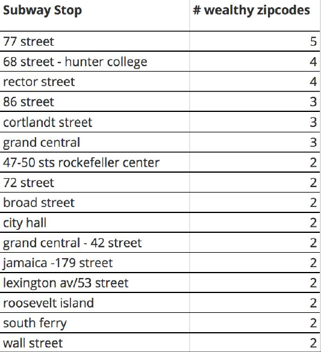
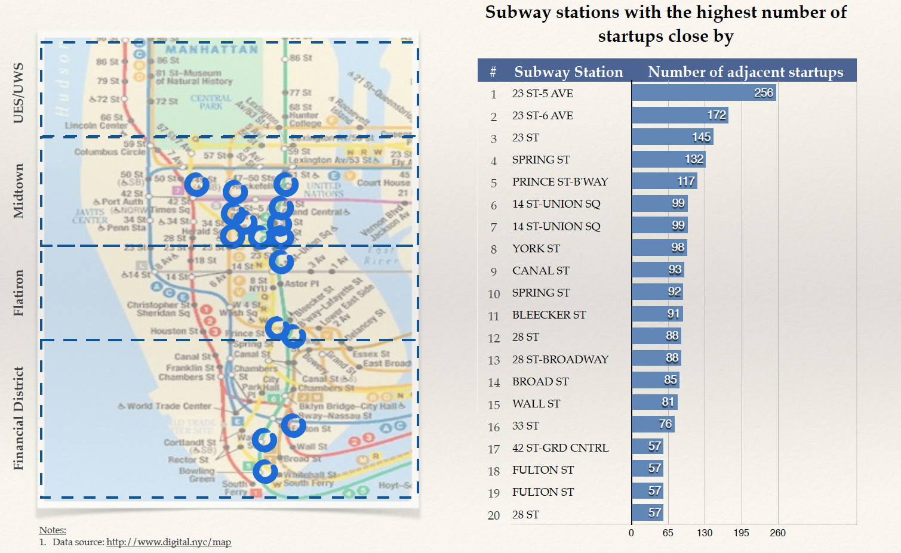
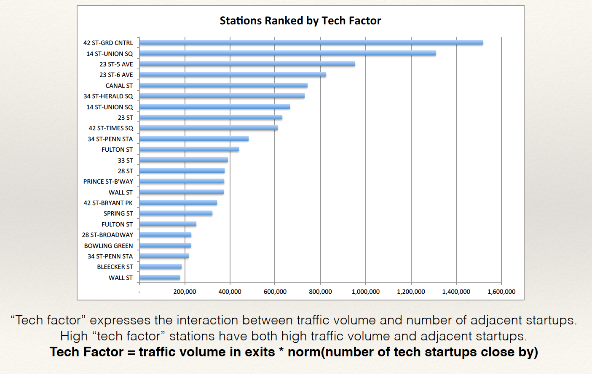

# Open-Ended Project

## Goals

A non-profit organization is trying to raise awareness about women in technology. We need to identify the best areas to canvas. The organization will be placing street teams at the enxtrances to various subway stations.

## Assumptions

List any assumptions you made in your analysis.

Examples:
- Combined 2 different Union Square stops
- Exclude Commuter Hubs (ie. Penn Station / GCT-Bryant Park)

## Approach

Explain your analysis about how you found the best stations. High-level research details.

Example:
- Highest Foot Traffic
- Tech Factor
- Gender %
- Income
- Universities

Zip Codes with Median Income > $70k

Student Audience

Startup Locality

## Cleaning the Data

Walkthrough how you cleaned the data and what issues you ran into. Mention any steps you took to exclude erroneous or outlier data.

Example:
- Some four-hour intervals were an hour off regular schedule
- There were some negative values
- There were some extremely high values

## Finding Target Stations

How did you go about filtering to find your list.

Example:
- Combine Approach with Assumptions to an Analytical Explanation
- Weighted average of different components
- Any mathematical formulas or equations

Simple Weighted Equation

## Final Recommendations

Here are the recommendations for the non-profit organization. Which stations, what days/times and why?

## Lessons Learned

Personal reflection on what you learned about Python, the Domain (NYC Subway system and canvassing), as well as Exploratory Data Analysis.

## Further Analysis

If you had more time or more data, what interesting questions would you like to explore. Gives random visitors some ideas if they want to expand on your project.

## Code Information

Steps explaining how to reproduce results. Which notebooks or Python scripts to run.
